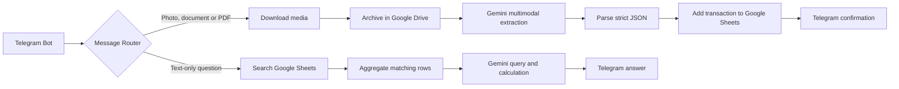
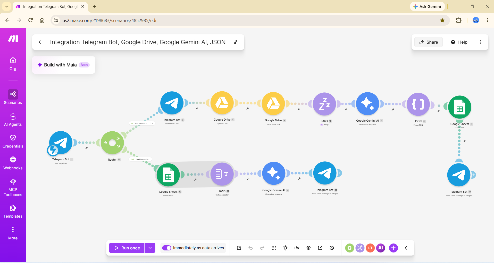
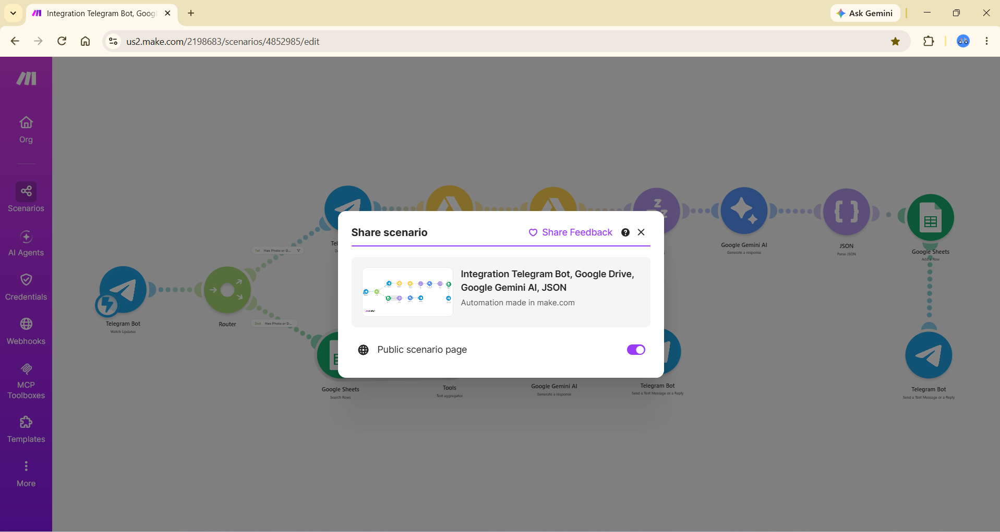
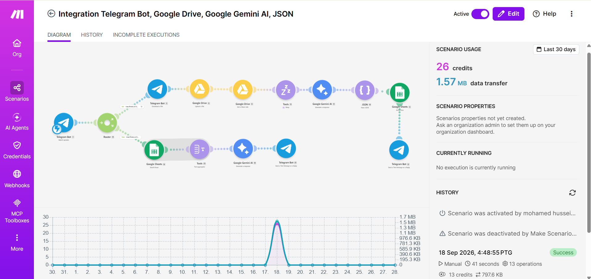

# AI-Powered Telegram Expense Assistant

An event-driven financial automation system that turns Telegram into a multimodal expense assistant. Users can send receipt photos, bank-transfer screenshots or PDF documents, and the workflow extracts structured transaction data with Google Gemini before recording it in Google Sheets. Text-only messages follow a second path, allowing users to ask natural-language questions about their spending and receive calculated answers in Telegram.

## Project highlights

- Built a dual-path Make.com workflow for media ingestion and conversational analytics.
- Connected Telegram Bot API, Google Drive, Google Sheets and Google Gemini 2.5 Flash.
- Parsed unstructured financial documents into a consistent JSON transaction schema.
- Combined images with user captions to resolve vague or missing merchant information.
- Aggregated spreadsheet rows before LLM analysis to prevent repeated Telegram replies and reduce unnecessary processing.
- Added strict output constraints to keep responses concise and prevent raw spreadsheet date serials from appearing in chat.

## Architecture

## Workflow A: receipt ingestion

1. The Telegram webhook receives a photo, document or PDF.
2. The router sends media messages to the extraction branch.
3. The file is downloaded, archived in Google Drive and made available to the AI step.
4. Gemini receives the media plus any user caption and normalises the transaction into a strict JSON schema.
5. The JSON parser validates the response before the record is added to Google Sheets.
6. Telegram sends a concise confirmation to the user.

## Workflow B: conversational expense queries

1. Text-only messages are routed away from the media pipeline.
2. Matching transaction rows are retrieved from Google Sheets.
3. A text aggregator combines the rows into one context payload, avoiding a 1:N bundle explosion.
4. Gemini interprets the question and performs the requested date filtering or spending calculation.
5. The final answer is returned in Telegram using a constrained response format.

## Example questions

- How much did I spend this week?
- What was my total spending last month?
- How much did I spend on a specific date?
- Show my recent transactions from a particular merchant.

## Technology stack

- **Workflow orchestration:** Make.com
- **User interface:** Telegram Bot API
- **AI:** Google Gemini API (`gemini-2.5-flash`)
- **Storage:** Google Drive API
- **Transaction ledger:** Google Sheets API
- **Processing:** routers, filters, regular expressions, JSON parser and text aggregator

## Engineering decisions

### Multimodal context for incomplete receipts

Bank-transfer screenshots may not identify a merchant clearly. The workflow combines the visual document with the user's Telegram caption so Gemini can use both sources when producing the transaction record.

### Preventing repeated execution

Google Sheets searches can return multiple bundles. Passing each bundle directly to the response path would trigger repeated AI calls and Telegram messages. A text aggregator combines the relevant records into one payload before calculation.

### Controlled model output

The extraction prompt requires machine-readable JSON, while the query prompt requires a short user-facing answer. Negative constraints remove conversational filler and prevent spreadsheet date serials from reaching the final response.

## Screenshots

### Complete dual-path workflow

### Public scenario configuration

### Operational evidence

## Security and privacy

This repository contains documentation and screenshots only. Bot tokens, API keys, Google credentials, webhook secrets, transaction records and personal financial data are intentionally excluded. Use environment or platform-managed connections when recreating the workflow.

## Portfolio summary

Designed and implemented an event-driven, multimodal expense automation workflow that extracts transaction data from receipts and bank-transfer evidence, records it in Google Sheets and answers natural-language spending questions through Telegram.
